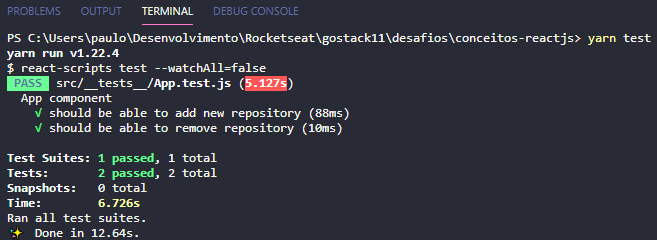
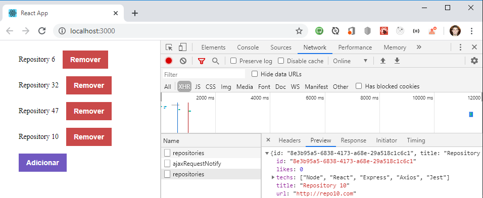

# bootcamp-gostack-desafio-3

Desafio 3 do Bootcamp GoStack 11


<h3 align="center">
  Desafio 03: Conceitos do ReactJS
</h3>

<p align="center">“Faça seu melhor, mas sempre com prazo de entrega”!</blockquote>

<p align="center">
  

  <a href="https://rocketseat.com.br">
    
  </a>

  

  <a href="https://github.com/Rocketseat/bootcamp-gostack-desafios/stargazers">
    
  </a>
</p>

<p align="center">
  <a href="#rocket-sobre-o-desafio">Sobre o desafio</a>&nbsp;&nbsp;&nbsp;|&nbsp;&nbsp;&nbsp;
  <a href="#keyboard-instalação-e-execução-dos-testes">Instalação e Execução dos Testes</a>&nbsp;&nbsp;&nbsp;|&nbsp;&nbsp;&nbsp;
  <a href="#template-da-aplicação">Template da aplicação</a>&nbsp;&nbsp;&nbsp;|&nbsp;&nbsp;&nbsp;
  <a href="#funcionalidades-da-aplicação-instruções">Funcionalidades da aplicação</a>&nbsp;&nbsp;&nbsp;|&nbsp;&nbsp;&nbsp;
  <a href="#especificação-dos-testes-instruções">Específicação dos testes</a>&nbsp;&nbsp;&nbsp;|&nbsp;&nbsp;&nbsp;
  <a href="#memo-licença">Licença</a>
</p>

## :rocket: Sobre o desafio

Nesse desafio foi criada uma aplicação para treinar o que aprendi até agora sobre ReactJS!

Foi dado continuidade ao desenvolvimento da aplicação que irá armazenar repositórios do meu portfólio. O backend foi desenvolvido no último desafio utilizando o Node.js **[Link para o Desafio 2](https://github.com/prenato84/conceitos-nodejs)**

### :keyboard: Instalação e Execução dos Testes

- Clone este repositório

```
> git clone https://github.com/prenato84/conceitos-reactjs
```

- Navegue até o diretório principal do projeto

```
> cd conceitos-reactjs
```

- Instale as dependências com o Yarn

```
yarn
```

- Rode os testes

```
yarn test
```

<p align="center">
  
</p>

### :keyboard: Execução do Projeto

Como esse projeto é apenas o frontend da aplicação, é necessário antes instalar e executar o projeto do backend conforme instruções do repositório dele **[Conceitos do Node.js](https://github.com/prenato84/conceitos-nodejs)**.

Com o backend iniciado, agora é possível que o frontend realiza as chamadas à API Rest disponibilizada por ele.

Para a execução do front, após ter instalado as dependências, basta iniciar o projeto:

```
yarn start
```

Uma página como esta será exibida permitindo adição e remoção de repositórios.

<p align="center">
  
</p>

### Template da aplicação

Foi utilizado um modelo de template que possui o esqueleto do projeto.

O template pode ser encontrado na seguinte url: **[Acessar Template](https://github.com/Rocketseat/gostack-template-conceitos-reactjs)**

**Dica**: Caso não saiba utilizar repositórios do Github como template, utilize o guia em **[nosso FAQ](https://github.com/Rocketseat/bootcamp-gostack-desafios/tree/master/faq-desafios).**

Agora navegue até a pasta criada e abra no Visual Studio Code, lembre-se de executar o comando `yarn` no seu terminal para instalar todas as dependências e já estará pronto para iniciar.

### Funcionalidades da aplicação (Instruções)

Agora que você já está com o template clonado, e pronto para continuar, você deve abrir o arquivo **src/App.js**, e completar onde não possui código com o código para atingir os objetivos de cada funcionalidade.

- **`Listar os repositórios da sua API`**: Deve ser capaz de criar uma lista com o campo **title** de todos os repositórios que estão cadastrados na sua API.

- **`Adicionar um repositório a sua API`**: Deve ser capaz de adicionar um novo item na sua API através de um botão com o texto **Adicionar** e, após a criação, deve ser capaz de exibir o nome dele após o cadastro.

- **`Remover um repositório da sua API`**: Para cada item da sua lista, deve possuir um botão com o texto **Remover** que, ao clicar, irá chamar uma função para remover esse item da lista do seu frontend e da sua API.

### Especificação dos testes (Instruções)

Em cada teste, tem uma breve descrição no que sua aplicação deve cumprir para que o teste passe.

Caso você tenha dúvidas quanto ao que são os testes, e como interpretá-los, dê uma olhada em **[nosso FAQ](https://github.com/Rocketseat/bootcamp-gostack-desafios/tree/master/faq-desafios).**

Para esse desafio temos os seguintes testes:

- **`should be able to add new repository`**: Para que esse teste passe, sua aplicação deve permitir que um repositório seja adicionado ao seu backend e listado no seu frontend dentro de uma `LI`.

- **`should be able to remove repository`**: Para que esse teste passe, sua aplicação deve permitir que ao clicar no botão de remover que vai estar dentro da `LI` do repositório adicionado, o item seja removido da listagem.

## :calendar: Entrega

Esse desafio deve ser entregue a partir da plataforma Skylab, envie o link do repositório que você fez suas alterações. Após concluir o desafio, fazer um post no Linkedin e postar o código no Github é uma boa forma de demonstrar seus conhecimentos e esforços para evoluir na sua carreira para oportunidades futuras.

## :memo: Licença

Esse projeto está sob a licença MIT. Veja o arquivo [LICENSE](LICENSE) para mais detalhes.

---

Feito com 💜 by <a href="https://www.linkedin.com/in/prenato84">Paulo Castro</a> :wave:
